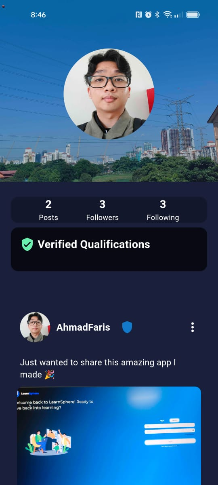
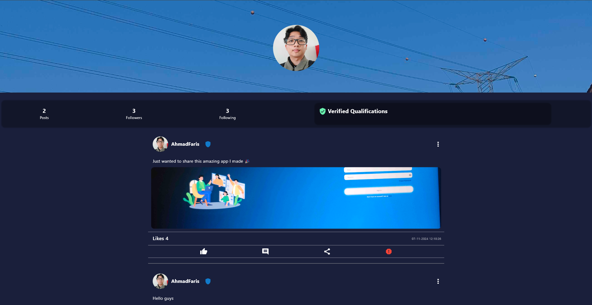

<br />
<div align="center">
  <a href="https://github.com/Kushiro79/SD_G01_03_LearnSphere_Educational_Social_Media">
    
  </a>

# LearnSphere - Social Media App
</div>

LearnSphere is a dynamic social media app built with Flutter, designed to connect users, enable content sharing, and foster a community of learners. This app allows users to share posts, follow other users, and engage with content through likes and comments.

<details>
  <summary>Table of Contents</summary>
  <ol>
    <li>
      <a href="#screenshots">Screenshots<a/>
      <ul>
        <li><a href="#mobile-screenshots">Mobile Screenshots</a></li>
        <li><a href="#web-screenshots">Web Screenshots</a></li>
      </ul>
    </li>
    <li>
      <a href="#features">Features</a>
    </li>
    <li><a href="#technologies-used">Technologies Used</a></li>
    <li>
      <a href="#getting-started">Getting Started</a>
      <ul>
        <li><a href="#prerequisites">Prerequisites</a></li>
        <li><a href="#installation">Installation</a></li>
      </ul>
    </li>
    <li><a href="#contribution">Contribution</a></li>
    <li><a href="#license">License</a></li>
  </ol>
</details>

## Screenshots:

### Mobile Screenshots

<table>
  <tr>
    <td align="center"><strong>Sign In</strong></td>
    <td align="center"><strong>Home</strong></td>
  </tr>
  <tr>
    <td></td>
    <td></td>
  </tr>
  <tr>
    <td align="center"><strong>Profile</strong></td>
    <td align="center"><strong>Admin</strong></td>
  </tr>
  <tr>
    <td></td>
    <td></td>
  </tr>
</table>

### Web Screenshots

<table>
  <tr>
    <td align="center"><strong>Sign In</strong></td>
    <td align="center"><strong>Home</strong></td>
  </tr>
  <tr>
    <td></td>
    <td></td>
  </tr>
  <tr>
    <td align="center"><strong>Profile</strong></td>
    <td align="center"><strong>Admin</strong></td>
  </tr>
  <tr>
    <td></td>
    <td></td>
  </tr>
</table>


## Features:
- User Profiles: Users can create and manage their profiles, displaying basic information and posts.
- Feed: A personalized feed where users can view posts from people they follow.
- Posts: Users can create, edit, and delete posts with text, images, or videos.
- Follow System: Users can follow other users to see their updates and interact with their content.
- Likes & Comments: Users can like and comment on posts to engage with content.
- Notifications: Users receive real-time notifications for interactions like comments on their posts.

## Technologies Used:
* Flutter [Installation Guide](https://docs.flutter.dev/get-started/install)
* VS Code [Installation Guide](https://code.visualstudio.com/docs/setup/windows)
* Android Studio [Installation Guide](https://developer.android.com/studio/install)
* Firebase [Setup Guide](https://firebase.google.com/docs/flutter/setup)

## Getting Started:
To get started with LearnSphere on your local machine, follow the steps below:

### Prerequisites:
- **Install Flutter**: Follow [Flutter's official guide](https://docs.flutter.dev/get-started/install) and verify setup by running `flutter doctor` in your terminal.
- **Install Android Studio**: Required for Android development and emulator setup.
- **Install Node.js**: Download from [Node.js](https://nodejs.org/en).
- **Install Firebase CLI**: Follow the [Firebase CLI Documentation](https://firebase.google.com/docs/cli).
  - After installation, initialize Firebase by running:
    ```bash
    firebase login
    firebase init
    ```
- **Install VS Code** (Optional): For development.
  - If using VS Code, install the **Flutter Extension** from the VS Code Marketplace.


### Installation:
1. Clone the repository:
    ```bash
    git clone https://github.com/Kushiro79/SD_G01_03_LearnSphere_Educational_Social_Media.git

2. Create a Firebase Project
   * Go to the Firebase Console and set up a new Firebase project.
   * For Android : Download the `google-services.json` file and place it in the `android/app` directory.
   * For Web : Add the Firebase configuration code to `web/index.html` inside the `<head>` tag.
    
3. Navigate to the project directory:
   ```bash
   cd SD_G01_03_LearnSphere_Educational_Social_Media

4. Install dependencies:
   Run the following command to get all the required packages:
   ```bash
   flutter pub get

5. Run the app:
   To run the app in development mode, use either of the following commands depending on your platform:
   - For Android:
     ```bash
     flutter run
   - For Web:
     ```bash
     flutter run -d chrome

## Contribution:
Thank you for the team that have contributed to the development of this app!

<a href="https://github.com/Kushiro79/SD_G01_03_LearnSphere_Educational_Social_Media/graphs/contributors">
  
</a>


## License:
This project is licensed under the MIT License - see the LICENSE file for details.

## Acknowledgments:
- Flutter: For providing an excellent framework for cross-platform app development.
- VSCode and Android Studio: For offering great tools for Flutter development.
